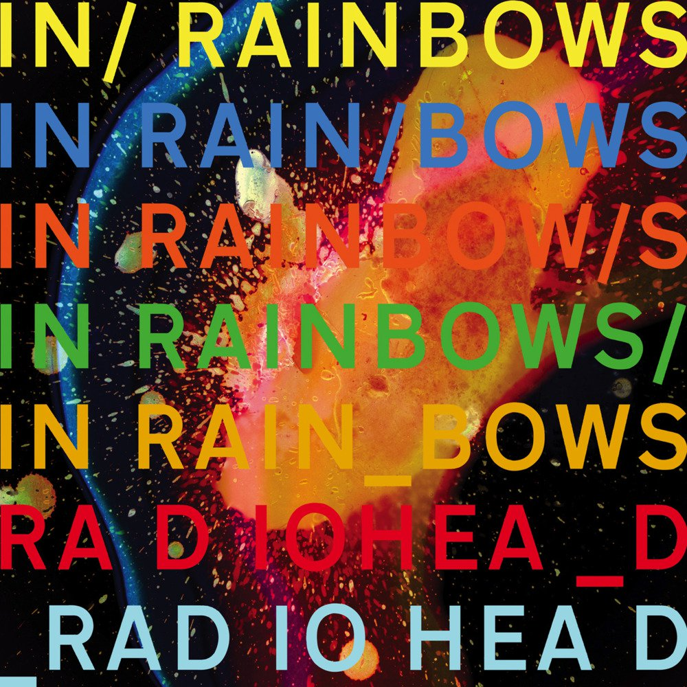

Other Stuff
=============

Note From The Creator
_______________________

My name is Sadık. I live in Istanbul and I am a third year computer engineering student. My favorite band is Radiohead. I also like watching anime and I am a great Bleach fan. I guess that's all about me.

.. image:: pics/aizen.gif

If you want to have contact with me, you can find me on `linkedin <www.linkedin.com/in/sadık-efe-kartav>`_. Or just mail me: sadikefe69@gmail.com

Why Wolta name?
________________

In early 2024, I watched a movie called The Peasants at the theatre, and I really loved it. There was a wolta dance scene and I wanted to name my library with this name.

Radiohead
____________

While creating Wolta, I listened to Radiohead a lot. Which is why, I will give a place to these great band with my favorite Radiohead album:

Donation
_________

I don't expect money. Honestly I maintain this project for my sake, so I appreciate your help request and redirect you to these charities:

- `LÖSEV <https://en.losev.org.tr/>`_ is a well-known charity for cancer diseased children in Turkey. Their wiki page is `there <https://tr.wikipedia.org/w/index.php?title=L%C3%96SEV&oldid=33653410>`_, it is only Turkish but you can easily translate it with a website translator.
- `Cancer Research UK <https://www.cancerresearchuk.org/about-cancer>`_
- `American Cancer Society <https://www.cancer.org/>`_